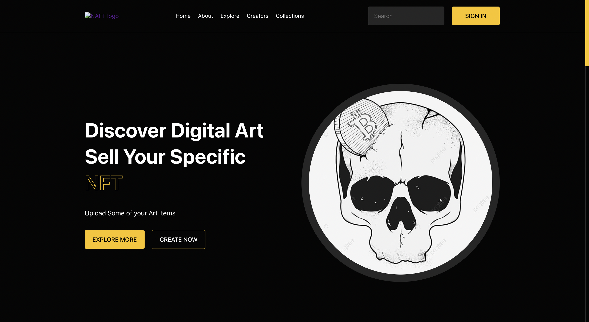
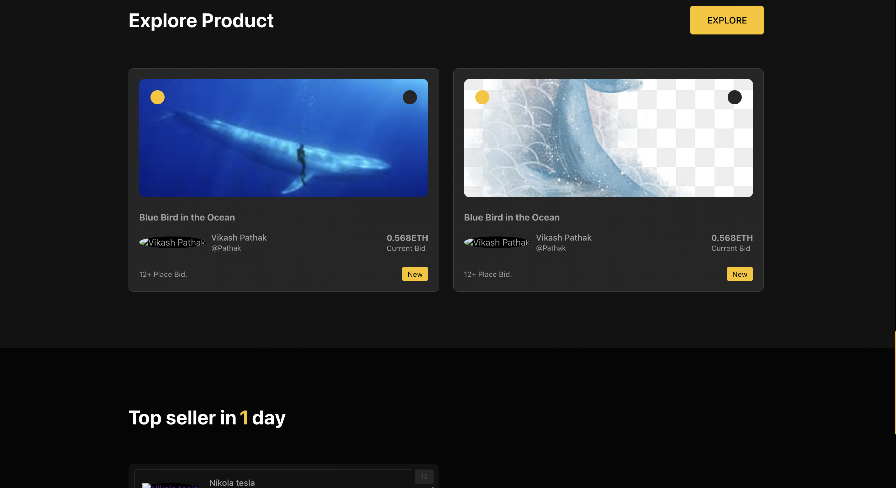
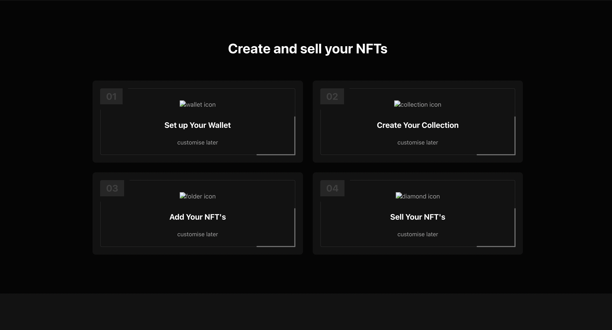
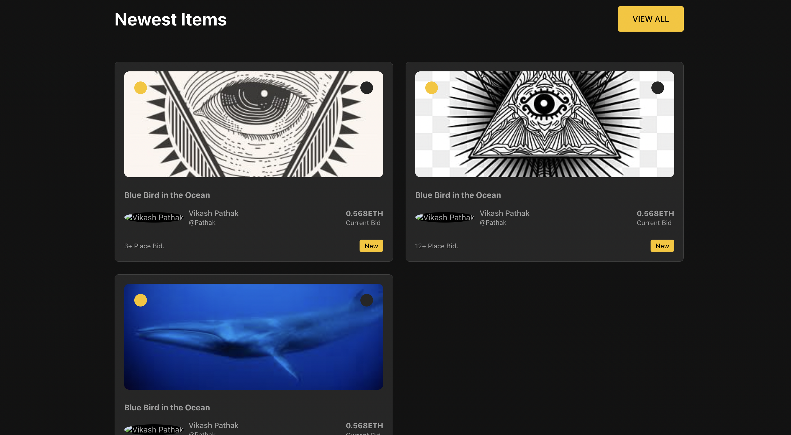

# NFT Market Place
<h1 align="center">
  <br/>
  NFT MarketPlace 
  <br/>
<br/>
</h1>
<p align='center'>
This project is for Nft-marketPlace where user can mint and Auction thier 
NFT
This project built using ERC721 contract 
</p>


##  [🐳 Demo url](https://marketplace-teal-six.vercel.app/)

### Demo






### Tech Stacks
Hardhat | Infura | Truffle | Ethereum

## 🔧 Tech Stack 
<p align="center">


<br/>


</p>


## 📃 Table of contents
- [Installation](#installation)
    - [Setup Backend](#setup-backend)
- [Commands](#⚙-commands)
- [Contributor](#👨🏻‍💻-contributor)


## 📥 Installation
- Start by cloning the repo with following command
```
git clone https://github.com/chotapathak/Nft-marketPlace.git
```

## 🔗 Setup Backend
go to the backend and install dependencies with `npm install`

### 🧮 Try running some of the following Commands:
```shell
cd Nft-marketPlace
npx hardhat accounts
npx hardhat compile
npx hardhat test
npx hardhat node
npx hardhat --migrate
npx run scripts scripts/sample-script.js

```

## Project frontend 
For Frontend am using [wagmi] Which is web3 frontend framework
```shell
cd client
yarn dev
```


## 👨🏻‍💻 Contributor
- ## [Vikash Pathak](https://www.linkedin.com/in/vikash-pathak-298a01183/?originalSubdomain=in)


